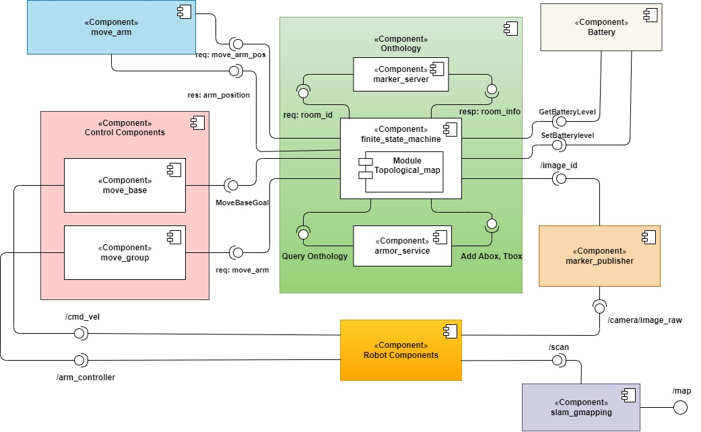

# Assignment2

# EXPROB_Assgnment_02
ROS package for patrolling an indoor environment with a mobile robot

## Introduction
This package is an experiment to use a topological map ontology for controling a robot using ROS. The ontology consists of an indoor environment
with multiple rooms and a mobile robot. You can get to know more about the detatils of the source code using the provided for this rospackage.

The robot starts in room E and by scanning the provided markers, it receives the information to build the semantic map, i.e., the name and center 
position of each room and the connections between them.

Once the semantic map is built, robot has to start moving among the rooms with the policy that each room that has not been visited for a long time,
would be selected as the target room. Everytime the robot gets to the target room, it has to scan the room environment as it did for the first time
with the markers.

When the robot battery is low, it goes to the charger which is placed in room E, sand wait for some times before to start again with the above behavior.

## Simulation Environment
The simulation software in this package is gazebo. The environment in which the robot should implement the 
scanning and patrolling behaviors, is shown in the following figures:

## Software Architecture
The software architucture is represented in the following figure.

<p align="center">

</p>


The components of this software architucture can be described as follows:

## Usage
### Installation
* This package is based on [aRMOR](https://github.com/EmaroLab/armor) it has to be installed as it is described
in the provided link as a pre-condition for running this package.

* It is also depended on [smach](http://wiki.ros.org/smach), it can be installed using the following commands:

```bashscript
$ sudo apt-get install ros-<distro>-executive-smach*
```
```bashscript
$ sudo apt-get install ros-<distro>-smach-viewer
```

* For image processing part, the [aruco_ros](https://github.com/CarmineD8/aruco_ros) and [cv_bridge](http://wiki.ros.org/cv_bridge) packages have to be cloned and setup.

* Regarding the navigation part, [slam_gmapping](http://wiki.ros.org/slam_gmapping)  and [move_base](http://wiki.ros.org/move_base) have to be installed .

* Finally, the [MoveIt](https://moveit.ros.org/) package has to be installed for robot joints trajectory planning and control.


Once the dependencies are met, the package can be installed as it follows:

```bashscript
$ mkdir -p catkin_ws/src
```
```bashscript
$ cd catkin_ws/src
```
```bashscript
$ https://github.com/awaistahir29/EXPROB_Assgnment_02.git
```
```bashscript
$ cd ..
```
```bashscript
$ source /opt/ros/<distro>/setup.bash
```
```bashscript
$ catkin_make
```

### Running
In order to initialize the software architucture along with the finite state machine representation, run the following command.

```bashscript
$ source devel/setup.bash
```
```bashscript
$ roslaunch assignment2 assignment2.launch
```

## Working Hypothesis and Environment

1. System's Features: The robot URDF which is used in this package was able to detect the markers with a camera mounted on a 5 dof manipulator. 
Additionally, it could find the best path to the target point while it generated the map in an online simultaneous manner.

2. System's Limitations: Battery level is the main limitation in this experiment, although it has chosen high enough to make the robot able to 
patrol the environment more conveniently.

3. Possible Technical Improvements: The robot could have been designed in such a way that there was a balance between the base and manipulator 
to avoid swinging in real case scenario. Of course, the ontology part could have been more comprehensive considering the power of PELLET reasoner.

## Authors and Contacts
- Awais Tahir
- email: S5174335@studenti.unige.it
